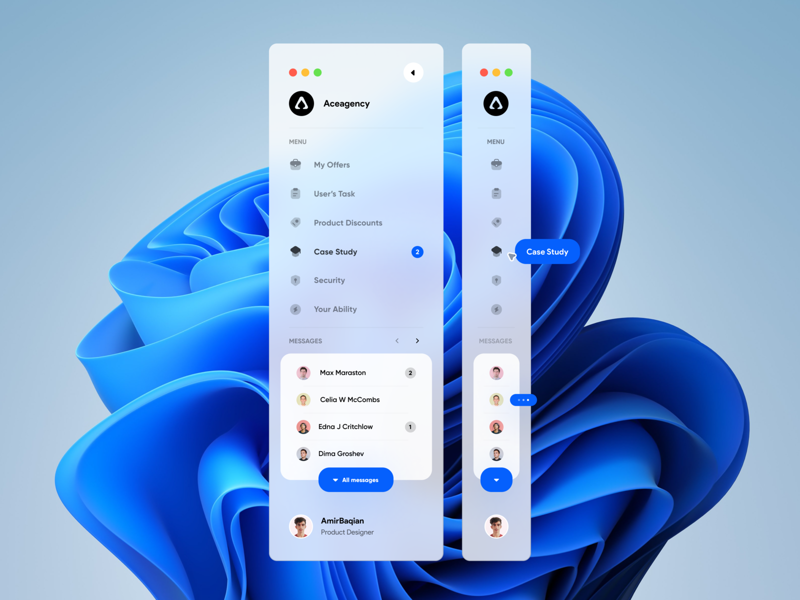

```markdown
# Projeto de Navegação Lateral 🚀

Este é um projeto para criar uma navegação lateral ou menu lateral para o seu conteúdo no YouTube.

## Instalação ⚙️

Certifique-se de ter o Node.js instalado no seu sistema. Em seguida, execute os seguintes comandos:

1. Clone o repositório:

   ```bash
   git clone https://github.com/seu-username/navigation.git
   cd navigation
   ```

2. Instale as dependências:

   ```bash
   npm install
   ```

## Uso 📋

Para iniciar o servidor de desenvolvimento, use o seguinte comando:

```bash
npm run dev
```

Isso iniciará o servidor e permitirá que você visualize e teste sua navegação lateral.

## Contribuição 🤝

Você pode contribuir para este projeto abrindo problemas (issues) ou enviando solicitações de pull (pull requests).

## Dependências 📦

- [Bootstrap](https://getbootstrap.com/)
- [React](https://reactjs.org/)
- [React Bootstrap](https://react-bootstrap.github.io/)
- [React Icons](https://react-icons.github.io/react-icons)

## Créditos 💡

O design da navegação lateral foi inspirado pelo trabalho de [Amir Baqian](https://dribbble.com/Amirbaqian). Você pode encontrar o design original [aqui](https://dribbble.com/shots/17143561-Sidebar-Navigation-Menu-Animation).

## Redes Sociais 🌐

Você pode me encontrar nas seguintes redes sociais:

- [Facebook](https://www.facebook.com/profile.php?id=100050680572102)
- [YouTube](https://www.youtube.com/channel/UCy1erA1OMEj2xHRMp9uo_rQ)
- [Instagram](https://www.instagram.com/danielkitanaxifilipe/)

## Links de Vídeos 🎥

Adicione aqui os links para seus vídeos do YouTube.

## Licença 📄

Este projeto está licenciado sob a Licença MIT. Consulte o arquivo [LICENSE](LICENSE) para obter mais detalhes.
```

Adicionar emojis pode dar um toque divertido e visualmente agradável ao seu README. Certifique-se de usar emojis relevantes para cada seção e para destacar informações importantes.